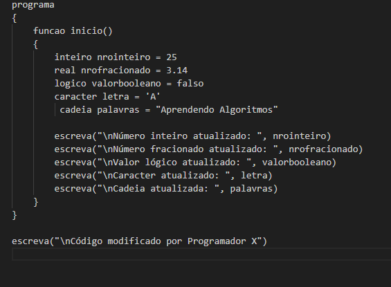

# Meu Projeto de Algoritmos

Este repositório contém um exemplo de código em linguagem de algoritmos.

## Captura de Tela

Abaixo, uma captura de tela do código em execução:

## Descrição

O código exemplifica o uso de diferentes tipos de variáveis como inteiros, reais, booleanos, caracteres e cadeias de caracteres.

O programa imprime valores atualizados de variáveis na saída padrão.
